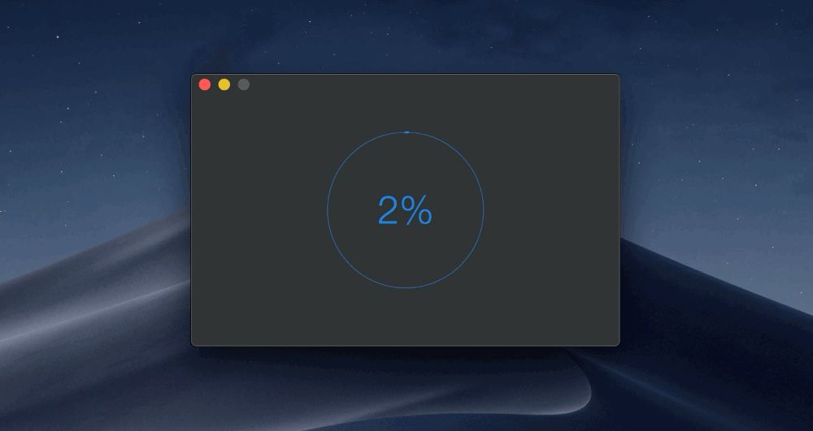

# CircularProgress

> Circular progress indicator for your macOS app



This package is used in production by the [Gifski](https://github.com/sindresorhus/gifski-app) and [HEIC Converter](https://sindresorhus.com/heic-converter) app.


## Requirements

- macOS 10.12+
- Xcode 10+
- Swift 4.2+


## Install

#### SwiftPM

```swift
.package(url: "https://github.com/sindresorhus/CircularProgress", from: "0.2.1")
```

#### Carthage

```
github "sindresorhus/CircularProgress"
```

#### CocoaPods

```ruby
pod 'CircularProgressMac'
```

<a href="https://www.patreon.com/sindresorhus">
	
</a>


## Usage

Also check out the example app in the Xcode project.

### Manually set the progress

```swift
import Cocoa
import CircularProgress

@NSApplicationMain
final class AppDelegate: NSObject, NSApplicationDelegate {
	@IBOutlet private var window: NSWindow!

	let circularProgress = CircularProgress(size: 200)

	func applicationDidFinishLaunching(_ notification: Notification) {
		window.contentView!.addSubview(circularProgress)

		foo.onUpdate = { progress in
			self.circularProgress.progress = progress
		}
	}
}
```

### Specify a [`Progress`](https://developer.apple.com/documentation/foundation/progress) instance

```swift
import Cocoa
import CircularProgress

@NSApplicationMain
final class AppDelegate: NSObject, NSApplicationDelegate {
	@IBOutlet private var window: NSWindow!

	let progress = Progress(totalUnitCount: 1)

	func applicationDidFinishLaunching(_ notification: Notification) {
		window.contentView!.addSubview(circularProgress)

		progress?.becomeCurrent(withPendingUnitCount: 1)
		circularProgress.progressInstance = progress
	}
}
```

### Cancel button


If you use the `.progress` property, you need to opt into the cancel button by setting `.isCancellable = true`. You can be notified of when the button is clicked by setting the `.onCancelled` property to a closure.

If you use the `.progressInstance` property, setting a `Progress` object that is [`isCancellable`](https://developer.apple.com/documentation/foundation/progress/1409348-iscancellable), which is the default, automatically enables the cancel button.


## API

```swift
/**
Color of the circular progress view.

Defaults to the user's accent color. For High Sierra and below it uses a fallback color.
*/
@IBInspectable var color: NSColor = .controlAccentColor

/**
Show `✔` instead `100%`.
*/
@IBInspectable var showCheckmarkAtHundredPercent: Bool = true

/**
The progress value in the range `0...1`.

- Note: The value will be clamped to `0...1`.
*/
@IBInspectable var progress: Double = 0

/**
Let a `Progress` instance update the `progress` for you.
*/
var progressInstance: Progress?

/**
Reset the progress back to zero without animating.
*/
func resetProgress() {}

/**
Cancels `Progress` if it's set and prevents further updates.
*/
func cancelProgress() {}

/**
Triggers when the progress was cancelled succesfully.
*/
var onCancelled: (() -> Void)?

/**
Returns whether the progress is finished.
*/
@IBInspectable private(set) var isFinished: Bool

/**
If the progress view is cancellable it shows the cancel button.
*/
@IBInspectable var isCancellable: Bool

/**
Returns whether the progress has been cancelled.
*/
@IBInspectable private(set) var isCancelled: Bool

init(frame: CGRect) {}
init?(coder: NSCoder) {}

/**
Initialize the progress view with a width/height of the given `size`.
*/
convenience init(size: Double) {}
```


## Related

- [DockProgress](https://github.com/sindresorhus/DockProgress) - Show progress in your app's Dock icon
- [Defaults](https://github.com/sindresorhus/Defaults) - Swifty and modern UserDefaults
- [Preferences](https://github.com/sindresorhus/Preferences) - Add a preferences window to your macOS app
- [LaunchAtLogin](https://github.com/sindresorhus/LaunchAtLogin) - Add "Launch at Login" functionality to your macOS app
- [More…](https://github.com/search?q=user%3Asindresorhus+language%3Aswift)

You might also like my [apps](https://sindresorhus.com/apps).


## License

MIT © [Sindre Sorhus](https://sindresorhus.com)
