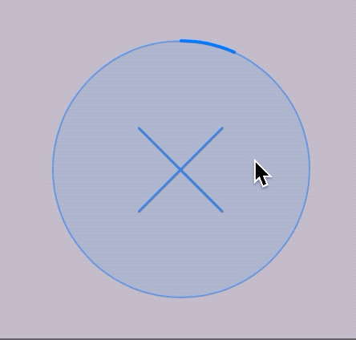

# CircularProgress

> Circular progress indicator for your macOS app


This package is used in production by apps like [Gifski](https://github.com/sindresorhus/Gifski) and [HEIC Converter](https://sindresorhus.com/heic-converter).

## Requirements

- macOS 10.12+
- Xcode 12.5+
- Swift 5.4+

## Install

#### Swift Package Manager

Add `https://github.com/sindresorhus/CircularProgress` in the [“Swift Package Manager” tab in Xcode](https://developer.apple.com/documentation/xcode/adding_package_dependencies_to_your_app).

#### Carthage

```
github "sindresorhus/CircularProgress"
```

#### CocoaPods

```ruby
pod 'CircularProgressMac'
```

## Usage

Also check out the example app in the Xcode project.

Note: All the properties/methods must be set/called from the main thread.

### Manually set the progress

```swift
import Cocoa
import CircularProgress

@main
final class AppDelegate: NSObject, NSApplicationDelegate {
	@IBOutlet private var window: NSWindow!

	let circularProgress = CircularProgress(size: 200)

	func applicationDidFinishLaunching(_ notification: Notification) {
		window.contentView!.addSubview(circularProgress)

		foo.onUpdate = { progress in
			self.circularProgress.progress = progress
		}
	}
}
```

### Specify a [`Progress`](https://developer.apple.com/documentation/foundation/progress) instance

The given `Progress` instance is strongly kept alive as long as the `CircularProgress` instance or until you set `.progressInstance = nil`.

```swift
import Cocoa
import CircularProgress

@main
final class AppDelegate: NSObject, NSApplicationDelegate {
	@IBOutlet private var window: NSWindow!

	let circularProgress = CircularProgress(size: 200)
	let progress = Progress(totalUnitCount: 1)

	func applicationDidFinishLaunching(_ notification: Notification) {
		window.contentView!.addSubview(circularProgress)

		progress?.becomeCurrent(withPendingUnitCount: 1)
		circularProgress.progressInstance = progress
	}
}
```

### Cancel button


If you use the `.progress` property, you need to opt into the cancel button by setting `.isCancellable = true`. You can be notified of when the button is clicked by setting the `.onCancelled` property to a closure.

If you use the `.progressInstance` property, setting a `Progress` object that is [`isCancellable`](https://developer.apple.com/documentation/foundation/progress/1409348-iscancellable), which is the default, automatically enables the cancel button.



Per default, the cancelled state is indicated by desaturing the current color and reducing the opacity. You can customize this by implementing the `.cancelledStateColorHandler` callback and returning a color to use for the cancelled state instead. The opacity is not automatically reduced when the callback has been set. To disable the cancelled state visualization entirely, set `.visualizeCancelledState` to `false`.

### Indeterminate state


Displays a state that indicates that the remaining progress is indeterminate.

Note that the `.progress` property and `.isIndeterminate` are not tied together. You'll need to manually set `.isIndeterminate = false` when progress is being made again.

If you use the `.progressInstance` property, the [`isIndeterminate`](https://developer.apple.com/documentation/foundation/progress/1412871-isindeterminate) property will automatically be observed. The view will then switch back and forth to the indeterminate state when appropriate.

### Hidden progress label


Displays a spinner without a percentage indicator in the center.

This is accomplished by setting the `.isLabelHidden` property to `true`. The default state is `false` (the label is displayed).

## API

```swift
/**
Color of the circular progress view.

Defaults to the user's accent color. For High Sierra and below it uses a fallback color.
*/
@IBInspectable var color: NSColor = .controlAccentColor

/**
Line width of the circular progress view.
*/
@IBInspectable var lineWidth: CGFloat = 2

/**
Show an animated checkmark instead of `100%`.
*/
@IBInspectable var showCheckmarkAtHundredPercent = true

/**
Hide the progress label.

The property supports KVO.
*/
@IBInspectable var isLabelHidden = true

/**
The progress value in the range `0...1`.

- Note: The value will be clamped to `0...1`.
*/
@IBInspectable var progress: Double = 0

/**
Let a `Progress` instance update the `progress` for you.
*/
var progressInstance: Progress?

/**
Reset the progress back to zero without animating.
*/
func resetProgress() {}

/**
Cancels `Progress` if it's set and prevents further updates.
*/
func cancelProgress() {}

/**
Triggers when the progress was cancelled succesfully.
*/
var onCancelled: (() -> Void)?

/**
Returns whether the progress is finished.

The property supports KVO.
*/
@IBInspectable var isFinished: Bool { get }

/**
If the progress view is cancellable it shows the cancel button.
*/
@IBInspectable var isCancellable: Bool

/**
Make the progress indeterminate.

The property supports KVO.
*/
@IBInspectable var isIndeterminate: Bool

/**
Returns whether the progress has been cancelled.

The property supports KVO.
*/
@IBInspectable var isCancelled: Bool { get }

/**
Determines whether to visualize changing into the cancelled state.
*/
var visualizeCancelledState: Bool = true

/**
Supply the base color to use for displaying the cancelled state.
*/
var cancelledStateColorHandler: ((NSColor) -> NSColor)?

init(frame: CGRect) {}
init?(coder: NSCoder) {}

/**
Initialize the progress view with a width/height of the given `size`.
*/
convenience init(size: Double) {}
```

## Related

- [DockProgress](https://github.com/sindresorhus/DockProgress) - Show progress in your app's Dock icon
- [Defaults](https://github.com/sindresorhus/Defaults) - Swifty and modern UserDefaults
- [Preferences](https://github.com/sindresorhus/Preferences) - Add a preferences window to your macOS app
- [KeyboardShortcuts](https://github.com/sindresorhus/KeyboardShortcuts) - Add user-customizable global keyboard shortcuts to your macOS app
- [LaunchAtLogin](https://github.com/sindresorhus/LaunchAtLogin) - Add "Launch at Login" functionality to your macOS app
- [Regex](https://github.com/sindresorhus/Regex) - Swifty regular expressions
- [More…](https://github.com/search?q=user%3Asindresorhus+language%3Aswift)

## Maintainers

- [Sindre Sorhus](https://github.com/sindresorhus)
- [Boy van Amstel](https://github.com/boyvanamstel)
